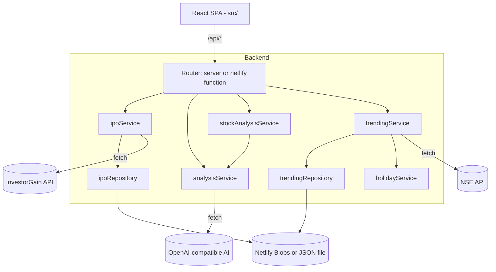
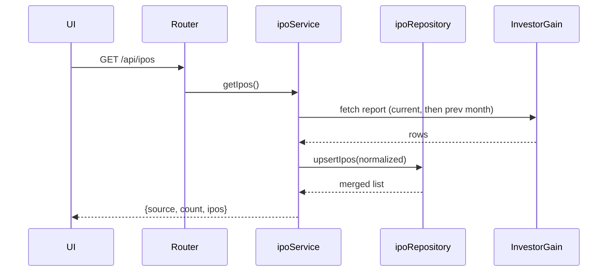

# Architecture

Related docs: [README.md](README.md) · [CODING_GUIDELINES.md](CODING_GUIDELINES.md) · [PROJECT_STRUCTURE.md](PROJECT_STRUCTURE.md)

## High-level architecture

IPO Analyzer is a React SPA backed by a thin server that proxies and normalizes
third-party data. The same server-side service layer runs in two hosts:

- **Local development** — a Node `http` server (`server/index.js`) with a manual
  router.
- **Production** — Netlify Functions (`netlify/functions/api.js`) that call the
  shared service layer directly, plus a scheduled function for trending refresh.

## Main components

| Component | Responsibility |
|---|---|
| `src/` (React) | UI: IPO grid, trending, stock analyzer, analysis modal; hooks for data + state |
| `server/index.js` | Local HTTP server bootstrap |
| `server/routes/router.js` | URL-prefix routing + CORS/OPTIONS handling |
| `server/controllers/*` | Map service results to HTTP responses |
| `server/services/*` | Business logic: fetch, normalize, AI streaming, market gating |
| `server/models/ipo.js` | Normalize raw report rows into a clean IPO shape |
| `server/repositories/*` | Persistence via Netlify Blobs or local JSON |
| `server/utils/*` | HTML/entity decoding, field parsers, URL building |
| `server/config/index.js` | Constants, env-var wiring, serverless detection |
| `netlify/functions/api.js` | Native Netlify Function serving all `/api/*` routes |
| `netlify/functions/trending-refresh.js` | Scheduled cron to refresh trending snapshots |

## Request / data flow

IPO listing (`GET /api/ipos`):

AI analysis (`POST /api/analyze`, `POST /api/analyze-stock`): the service builds
a fixed markdown-template prompt and streams tokens from an OpenAI-compatible
`/chat/completions` endpoint. Locally the response streams chunked; on
serverless the tokens are collected and returned as a single body.

## External integrations

| Integration | Endpoint (host) | Used by |
|---|---|---|
| InvestorGain report | `webnodejs.investorgain.com` (report `331`) | `ipoService` |
| NSE top gainers/losers | `nseindia.com/api/live-analysis-variations` | `trendingService` |
| NSE holiday master | NSE holiday API (dynamic, cached) | `holidayService` |
| AI provider | `AI_BASE_URL` (Gemini default) | `analysisService`, `stockAnalysisService` |

## Configuration flow

`dotenv` loads `.env` at startup. `server/config/index.js` centralizes constants
and reads env vars (`PORT`, `AI_API_KEY`/`GEMINI_API_KEY`, `AI_BASE_URL`,
`AI_MODELS`/`AI_MODEL`). It detects serverless via `NETLIFY`/`LAMBDA_*`/`AWS_*`
env vars to choose storage paths (`/tmp` vs `server/data/`). `netlify.toml`
defines build command, publish dir, functions dir, esbuild bundler, redirects,
and secrets-scanner omissions.

## Error-handling flow

- **Upstream fetch failure** — `ipoService` tries current then previous month,
  then falls back to stored data (`source: 'cache'`), then `source: 'error'`.
- **AI failures** — `streamCompletion` retries transient `503`/`429` with
  backoff, falls back across the configured model list, and throws the last
  error if all fail; serverless handlers return `502` with partial text.
- **NSE failures** — direct call first, then a cookie-handshake retry; failures
  surface as `502` with an empty `stocks` payload.
- **Persistence failures** — Blob read/write errors are logged and degrade to
  ephemeral `/tmp` or empty results.

## Logging & monitoring

Uses `console.log` / `console.error` only (server bootstrap, scheduled function,
repository/blob failures). No structured logging or external monitoring is
configured. **To be confirmed.**

## Security boundaries

- Server-side proxy keeps upstream API details and the AI key out of the browser.
- Permissive CORS (`*`) on both the local router and Netlify Function.
- AI endpoints reject requests when no key is configured (`503`) and validate
  JSON bodies (`400`) and method (`405`).
- No authentication/authorization layer present. **To be confirmed.**

## Important design decisions

- **Shared service layer** reused by both the local server and Netlify Functions.
- **Dual persistence** (Netlify Blobs vs local JSON) selected by runtime detection.
- **Fresh Blob store per call** to avoid expired request-scoped tokens on warm Lambdas.
- **In-memory AI cache** keyed by analysis-relevant IPO fields to cut cost/latency.
- **Model fallback list** for resilience against overloaded/rate-limited models.
- **Market-hours + holiday gating** (IST) for the scheduled trending refresh.

## Known limitations / to confirm

- No automated tests, linting, or formatting configuration.
- Serverless AI responses cannot stream (collected then returned).
- Reliance on undocumented third-party endpoints that may change without notice.
- `VITE_OPENAI_API_KEY` referenced in README as a client key; confirm intended
  usage vs the server-side `AI_API_KEY`.
