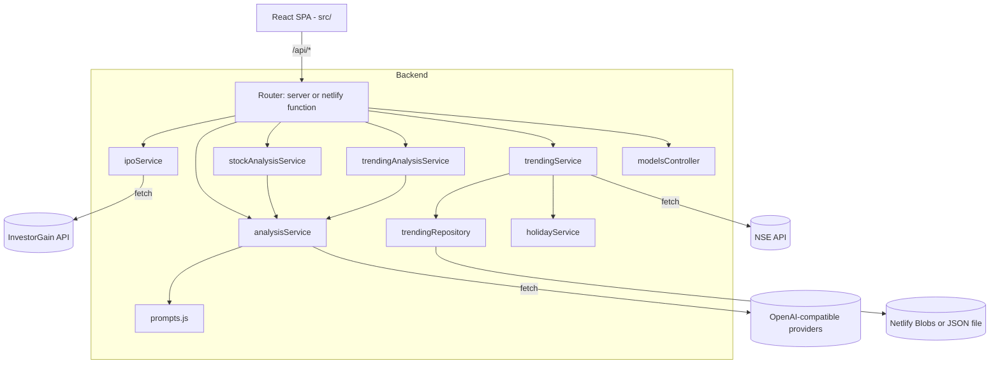
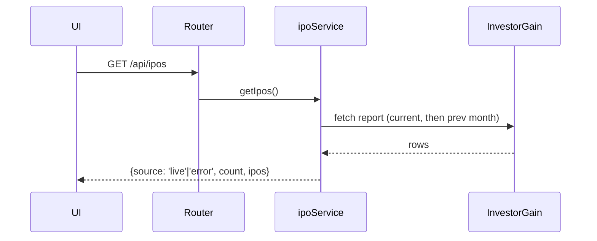

# Architecture

Related docs: [README.md](README.md) · [CODING_GUIDELINES.md](CODING_GUIDELINES.md) · [PROJECT_STRUCTURE.md](PROJECT_STRUCTURE.md)

## High-level architecture

StockSense is a React SPA backed by a thin server that proxies and normalizes
third-party data. The same server-side service layer runs in two hosts:

- **Local development** — a Node `http` server (`server/index.js`) with a manual
  router.
- **Production** — Netlify Functions (`netlify/functions/api.js`) that call the
  shared service layer directly, plus a scheduled function for trending refresh.

## Main components

| Component | Responsibility |
|---|---|
| `src/` (React) | UI: IPO grid, trending, stock analyzer, analysis modal, model selector; hooks for data + state |
| `server/index.js` | Local HTTP server bootstrap |
| `server/routes/router.js` | URL-prefix routing + CORS/OPTIONS handling |
| `server/controllers/*` | Map service results to HTTP responses |
| `server/services/*` | Business logic: fetch, normalize, AI streaming, market gating |
| `server/services/prompts.js` | Centralized fixed markdown prompt templates |
| `server/models/ipo.js` | Normalize raw report rows into a clean IPO shape |
| `server/repositories/*` | Trending/holiday persistence via Netlify Blobs or local JSON |
| `server/utils/*` | HTML/entity decoding, field parsers, URL building |
| `server/config/index.js` | Constants, multi-provider AI config, env-var wiring, serverless detection |
| `netlify/functions/api.js` | Native Netlify Function serving all `/api/*` routes |
| `netlify/functions/trending-refresh.js` | Scheduled cron to refresh trending snapshots |

## Request / data flow

Routes (matched by URL prefix): `GET /api/models`, `GET /api/ipos`,
`GET /api/trending`, `GET /api/trending-refresh`, `POST /api/analyze`,
`POST /api/analyze-stock`, `POST /api/analyze-trending`.

IPO listing (`GET /api/ipos`) — fetched live each request, not persisted:

AI analysis (`POST /api/analyze`, `/api/analyze-stock`, `/api/analyze-trending`):
the service builds a fixed markdown-template prompt (from `prompts.js`) and
streams tokens from an OpenAI-compatible `/chat/completions` endpoint. The
requested model is sent per request; `streamCompletion` tries the selected model
first, then falls back across the other configured models. Locally the response
streams chunked; on serverless the tokens are collected and returned at once.
The UI discovers available models via `GET /api/models`.

## External integrations

| Integration | Endpoint (host) | Used by |
|---|---|---|
| InvestorGain report | `webnodejs.investorgain.com` (report `331`) | `ipoService` |
| NSE top gainers/losers | `nseindia.com/api/live-analysis-variations` | `trendingService` |
| NSE holiday master | NSE holiday API (dynamic, cached) | `holidayService` |
| AI providers | Groq / Gemini / OpenAI / custom OpenAI-compatible base URLs | `analysisService`, `stockAnalysisService`, `trendingAnalysisService` |

## Configuration flow

`dotenv` loads `.env` at startup. `server/config/index.js` centralizes constants
and builds the AI provider registry (`AI_PROVIDERS`, `AI_MODELS`). Each provider
(`groq`, `gemini`, `openai`, `custom`) is active only when BOTH its `*_API_KEY`
and `*_MODELS` env vars are set; every active model is selectable from the UI.
It detects serverless via `NETLIFY`/`LAMBDA_*`/`AWS_*` env vars to choose storage
paths (`/tmp` vs `server/data/`). `netlify.toml` defines build command, publish
dir, functions dir, esbuild bundler, redirects, and secrets-scanner omissions.

## Error-handling flow

- **Upstream fetch failure** — `ipoService` tries current then previous month,
  then returns `source: 'error'` (IPO data is not persisted).
- **AI failures** — `streamCompletion` retries transient `429`/`500`/`502`/`503`/`504`
  with backoff, falls back across configured models (selected first), enforces an
  idle timeout per stream, and surfaces the selected model's error; serverless
  handlers return `502` with partial text.
- **NSE failures** — direct call first, then a cookie-handshake retry; failures
  surface as `502` with an empty `stocks` payload.
- **Persistence failures** — Blob read/write errors are logged and degrade to
  ephemeral `/tmp` or empty results.

## Logging & monitoring

Uses `console.log` / `console.error` only (server bootstrap, scheduled function,
repository/blob failures). No structured logging or external monitoring is
configured. **To be confirmed.**

## Security boundaries

- Server-side proxy keeps upstream API details and AI keys out of the browser.
- Permissive CORS (`*`) on both the local router and Netlify Function.
- AI endpoints reject requests when no provider is active (`503`) and validate
  JSON bodies (`400`) and method (`405`).
- No authentication/authorization layer present. **To be confirmed.**

## Important design decisions

- **Shared service layer** reused by both the local server and Netlify Functions.
- **Centralized prompts** in `prompts.js` for a single source of output format.
- **Multi-provider AI registry** built from env vars; per-request model selection
  with fallback across all configured models.
- **No IPO persistence** — IPO data is fetched live each request; only trending
  snapshots and holidays are persisted (Netlify Blobs vs local JSON).
- **Fresh Blob store per call** to avoid expired request-scoped tokens on warm Lambdas.
- **In-memory AI cache** keyed per model + analysis-relevant fields to cut cost/latency.
- **Idle-timeout streaming** aborts stalled provider responses without cutting slow-but-active streams.
- **Market-hours + holiday gating** (IST) for the scheduled trending refresh.

## Known limitations / to confirm

- No automated tests, linting, or formatting configuration.
- Serverless AI responses cannot stream (collected then returned).
- Reliance on undocumented third-party endpoints that may change without notice.
